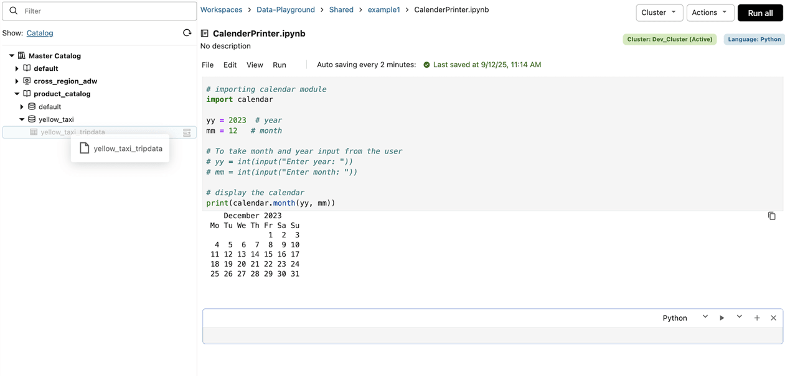
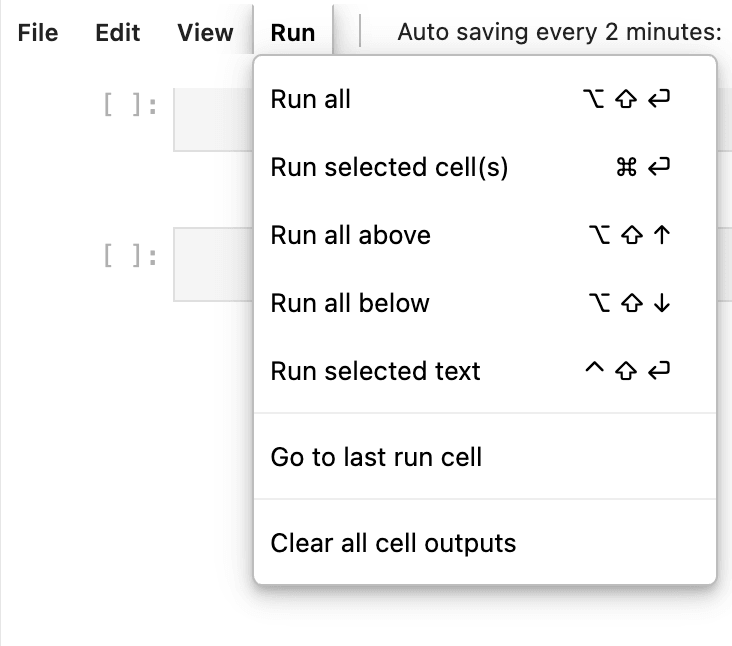
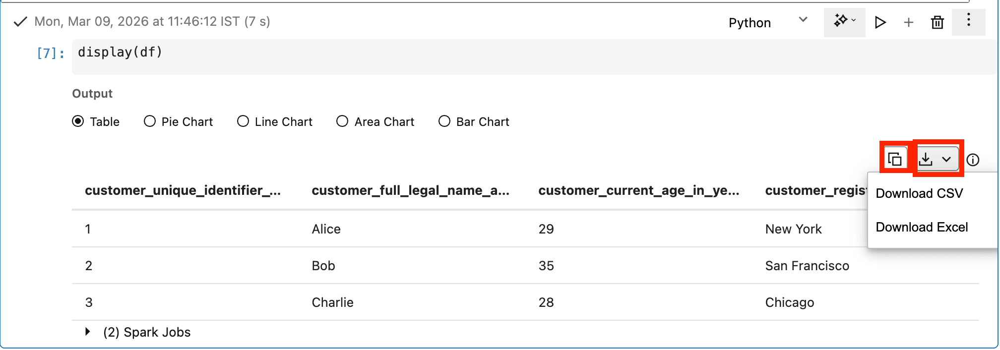
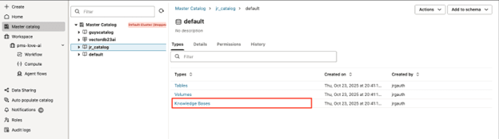
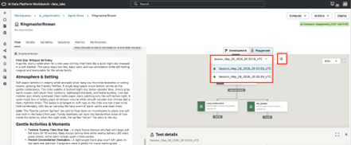
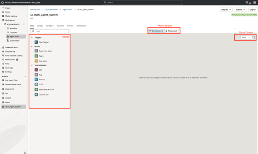
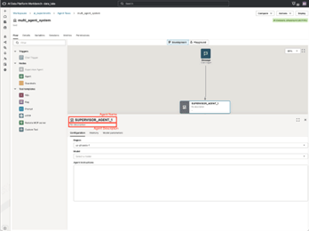
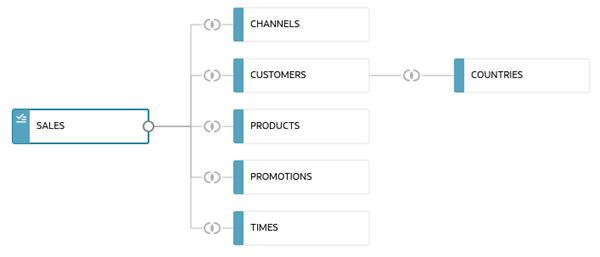
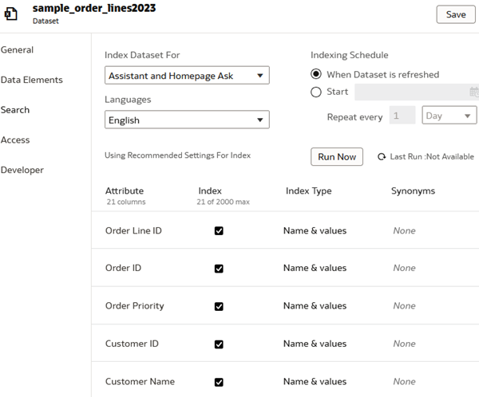
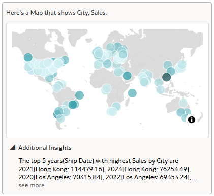

# Origami Health — Hands-on Data, Analytics & AI Workshop

Two 90-minute AIDP hands-on sessions, followed by a separate OAC session. No prior AIDP or OCI experience is assumed. Read each explanation, follow the actions, then check your result.

Before you begin: use the workshop link and personal folder supplied by your presenter. If a notebook, knowledge base or agent is missing, ask for help. Some live AI exercises still await verification; your presenter will confirm whether to run them or review an example. The OAC session uses a separate dataset and sign-in link.

Claims, Benefits, Provider and Member Operations: build trusted data, investigate unusual claims, answer benefit inquiries with evidence, and explore claims-operations insights.

Screenshots show Oracle interface examples, not actual Origami results. Use the filenames and expected values in the instructions.

## Half-Day 1 · Setup and access check — allow 15–20 minutes

**Objective:** Get ready to work safely in your assigned environment.

**What to do:** Open notebook 00, select the assigned compute and run the access checks.

**Intended outcome:** Identify your workspace, data paths and compute; recognize when to ask for help.

### Step 1: Find your workshop notebooks

OCI is Oracle’s cloud platform. AIDP Workbench is the application you will use to explore data and run code. A workspace holds your notebooks; a notebook combines explanations, code cells and their results.

**What to do**

1. Open the workshop AIDP link supplied by your presenter and sign in with your own account.
2. Open Workspaces, choose the workshop workspace and open your personal folder. Read CLASS_START_HERE or START_HERE, then open day1/00_setup_check.ipynb.

**What you should see / learn:** You can see notebook 00 and its first instructions. If your folder is missing, ask the presenter before continuing.

Where to look: Use the breadcrumb above the notebook to see which workspace and folder you opened. Oracle interface example; names and data may differ. See visual-sources.md for attribution.

### Step 2: Connect the notebook to compute

Compute is the processing engine that runs notebook code. These labs use Spark to work with datasets. Opening a notebook does not, by itself, start running its code.

**What to do**

1. At the top of the notebook, select the compute named in your workshop instructions. Wait until it is ready.
2. Select the first code cell, below “Load administrator-prepared participant bindings”, and choose Run selected cells or its play button. This cell loads the workshop settings; you do not need to enter passwords or change cloud settings.

**What you should see / learn:** The cell finishes without an error. Run this first settings cell again when you open each new notebook.

Where to look: Find Run selected cells in the Run menu. Use the menu or play button; the example keyboard shortcuts may differ on Windows. Oracle interface example; names and data may differ. See visual-sources.md for attribution.

### Step 3: Check that you can read the training data

A quick read check confirms that your notebook can reach the synthetic claims data before you begin processing it.

**What to do**

1. Read “Read-only readiness check”, select its code cell and run it.
2. Check your participant identifier and snapshot date, then look at the sample rows and the message “Basic read checks passed”. If a cell fails, show the presenter its error text rather than rerunning it repeatedly.

**What you should see / learn:** The check shows three sample source rows and the workshop snapshot. You are ready to start Lab 1.

Where to look: Results appear below the cell. Your check may show text as well as a table; this screenshot illustrates table output controls. Oracle interface example; names and data may differ. See visual-sources.md for attribution.

Save: A completed access checklist or a recorded blocker and agreed paired-work fallback.

Files in the participant asset pack:

- day1/00_setup_check.ipynb

### Visual walkthrough

Open `index.html#setup` in the guide ZIP for diagrams, annotated reference screenshots and expected-result checkpoints.

#### Find your notebook and its compute

Product reference from Oracle documentation, not a live Origami capture. Example names and data differ.

- Top breadcrumb: check your assigned folder and notebook, not the example names shown here.
- Top right: confirm the facilitator-assigned Spark compute is active.
- Read the explanations above each cell. Run the first settings cell in every notebook.

## Half-Day 1 · Lab 1: Medallion architecture: Bronze/Silver (30 min)

**Business benefit — Trust the claims entering analysis:** Identify bad and duplicate records before they distort reporting.

**Demonstrate it:** Reconcile all 725 source rows and explain one rejected claim.

**Objective:** Turn raw claims into trustworthy, traceable data.

**What to do:** Run Bronze/Silver, inspect one rejected record and reconcile accepted, rejected and duplicate counts.

**Intended outcome:** Explain what Bronze and Silver do, why records fail checks and how reconciliation prevents silent data loss.

### Before you begin

- Complete the preceding activity and open the files listed below. Ask your presenter if a file or service is missing.

## Follow these steps

### Step 1: Open the Bronze notebook and check its settings · 3 min

Medallion architecture organises data into layers: Bronze keeps incoming records, Silver checks and cleans them, and Gold shapes them for business questions. You will follow one claims dataset through these layers.

**What to do**

1. Open day1/01_bronze.ipynb and select the workshop compute.
2. Run the first settings cell. Check that the participant identifier is yours and the snapshot date is 2026-09-01. Keep the supplied data paths unchanged.

**What you should see / learn:** The notebook has loaded your workshop settings with no error. You can explain why the raw data is kept before cleaning.

Where to look: Check the notebook name in the breadcrumb and the compute selector above the cells. Oracle interface example; names and data may differ. See visual-sources.md for attribution.

### Step 2: Load the raw claims into Bronze · 7 min

Bronze preserves the original values, including values that may later fail a quality check. Source metadata tells you where each record came from; this traceability helps investigate a problem without losing the original evidence.

**What to do**

1. Read “Land the seven source datasets”, then run its code cell and wait for completion.
2. Inspect the dataset counts: claims has 725 source rows. In the sample, find source_record_id, claim_id, submitted_amount and _source_file. Notice that a raw amount can still be text.

**What you should see / learn:** Seven source datasets are loaded and claims has 725 rows. Identify the source-file field on one claim.

Where to look: Select the cell under the named heading, run it once, and read the output before opening the next notebook. Oracle interface example; names and data may differ. See visual-sources.md for attribution.

### Step 3: Clean the data and investigate a rejected row · 12 min

Silver standardises values, removes duplicate records and separates rows that fail checks. A quarantined row is set aside for investigation—it does not mean that an insurance claim has been denied or identified as fraud.

**What to do**

1. Open day1/02_silver.ipynb. Run its first settings cell, then the cell under “Evaluate, deduplicate, quarantine and reconcile”.
2. Find a rejected record in the output and read its reject_reason. Explain which check failed and why that row should not enter the trusted dataset yet. Leave the training source unchanged.

**What you should see / learn:** You see accepted, rejected and duplicate counts, and can explain one rejected row using its actual reason.

Where to look: Read the result below the Silver cell. Inspect the rejection reason, not only the success indicator. Oracle interface example; names and data may differ. See visual-sources.md for attribution.

### Step 4: Account for every source row · 8 min

Reconciliation asks whether every input row has a known outcome. Without it, a successful-looking pipeline could silently drop or duplicate claims and distort reporting.

**What to do**

1. Compare the summary with 725 input rows = 720 accepted + 4 rejected + 1 duplicate. These categories must not overlap.
2. Save the reconciliation summary and your explanation of one rejected row in your workshop notes. The notebook also saves silver.json for the next lab.

**What you should see / learn:** All 725 rows are accounted for. You can explain the difference between a quality rejection and a duplicate.

Where to look: Use Copy or Download for table outputs when available; for text output, copy the summary or take a screenshot. Oracle interface example; names and data may differ. See visual-sources.md for attribution.

### Check your result

- Explain why Bronze preserves the source values and Silver applies quality checks.
- Account for all 725 rows: 720 accepted, 4 rejected and 1 duplicate.
- Explain one rejection using its recorded reason; a quality rejection is not an insurance denial.

Save: A reconciliation summary and an explanation of one rejected record.

### Files in the participant asset pack

- day1/01_bronze.ipynb
- day1/02_silver.ipynb

### Optional / take-home — outside the core timebox

- Inspect multi-plan enrollment joins and precomputed document-evidence flags.
- Write a new transformation or rerun the complete pipeline from scratch.

### Visual walkthrough

Open `index.html#lab1` in the guide ZIP for diagrams, annotated reference screenshots and expected-result checkpoints.

#### Run one cell at a time

Product reference from Oracle documentation, not a live Origami capture. Example names and data differ.

- Select the next code cell, then use Run selected cell(s) or the cell play control.
- Wait for completion and inspect the result before continuing. Do not start with Run all.
- The reference image shows Mac shortcuts; use the menu or play control on your laptop.

## Half-Day 1 · Lab 2: Publish Claims and Benefits data to AI Lakehouse (20 min)

**Business benefit — Reuse one governed data foundation:** Give claims analysts and member-service teams data at the right level of detail.

**Demonstrate it:** Validate claims totals and the supplied member-benefit queries.

**Objective:** Make validated claims and benefits data available for analysis.

**What to do:** Run Gold and Lakehouse notebooks; check claim totals and one member’s active plans.

**Intended outcome:** Distinguish claim-level facts from summaries and avoid double-counting when combining data.

### Before you begin

- Complete the preceding activity and open the files listed below. Ask your presenter if a file or service is missing.

## Follow these steps

### Step 1: Understand the Gold datasets · 3 min

Gold reshapes clean data around business questions. A dataset’s grain means what one row represents: one claim, one monthly summary, or one member-plan enrollment. Mixing grains can double-count money or members.

**What to do**

1. Open day1/03_gold.ipynb and read “Build Gold outputs without enrollment fan-out”.
2. Identify the claim-detail, monthly-summary and member-plan outputs before running them. A member with two plans must not cause every claim to be counted twice.

**What you should see / learn:** You can describe what one row represents in the three outputs.

Where to look: Read the notebook’s explanation above its code cell before running the transformation. Oracle interface example; names and data may differ. See visual-sources.md for attribution.

### Step 2: Build Gold and publish it to the Lakehouse · 7 min

The AI Lakehouse makes the curated tables available for SQL and analytics. The workshop connection is already supplied, so your task is to run the data transformation and check its results.

**What to do**

1. Run notebook 03’s first settings cell and then its Gold cell. Check the five output counts: claim detail 720, monthly claims 36, member plans 100, benefit usage 80 and benefit schedule 6.
2. Open day1/04_lakehouse.ipynb, run its first settings cell, then “Publish into pre-created participant tables”. Wait for completion; stop and ask for help if the output reports a mismatch.

**What you should see / learn:** All five Gold datasets are built and the Lakehouse publish check succeeds. Reusing matching existing rows on a repeat run is expected.

Where to look: Run the named cells in order. A running cell needs to finish before you inspect its output. Oracle interface example; names and data may differ. See visual-sources.md for attribution.

### Step 3: Validate the two business queries · 7 min

A table existing is not enough: the answers must be correct. The supplied SQL checks confirm both claims totals and the member’s current plans.

**What to do**

1. In notebook 04, run “Run the two participant checks”. Compare the 720-claim count and amount totals with the supplied expected results.
2. Inspect the active-plan result: the teaching member has BASE and PLUS for 2026; the expired 2025 plan is excluded. Keep each plan’s limits separate—two active plans do not prove that their limits can be added.

**What you should see / learn:** Both queries match the expected results. You can explain why an expired plan must not be used in a current benefits answer.

Where to look: Inspect both query outputs, not just the first table. The example rows in this image are not the workshop’s expected values. Oracle interface example; names and data may differ. See visual-sources.md for attribution.

### Step 4: Keep the evidence for the next session · 3 min

Saving the actual query results gives you a baseline for checking the member facts used by the AI exercises in Day 2.

**What to do**

1. Keep the two query outputs with your Lab 1 reconciliation notes. The notebook saves lakehouse-two-checks.json.
2. Write one sentence explaining how claim detail differs from a monthly summary, and one explaining why plan limits remain separate.

**What you should see / learn:** You have two checked query results and can explain the main double-counting risk.

Where to look: Copy, download or capture the outputs that show your actual checks. Oracle interface example; names and data may differ. See visual-sources.md for attribution.

### Check your result

- Both Lakehouse checks match the expected claims totals and current member plans.
- Explain why joining every claim to multiple member plans would inflate totals.
- Keep BASE and PLUS limits separate until a coordination rule is established.

Save: Two validated query results and the Day 2 snapshot reference.

### Files in the participant asset pack

- day1/03_gold.ipynb
- day1/04_lakehouse.ipynb

### Optional / take-home — outside the core timebox

- Inspect full duplicate/orphan/overlap checks and repeat-run evidence.
- Author workflow dependencies, connection settings or new Lakehouse tables.

### Visual walkthrough

Open `index.html#lab2` in the guide ZIP for diagrams, annotated reference screenshots and expected-result checkpoints.

#### Keep the output that proves your check

Product reference from Oracle documentation, not a live Origami capture. Example names and data differ.

- For a displayed result table, find Copy or Download beside the output.
- Save your Origami claim reconciliation and active-plan query result, not these example rows.
- A finished cell is not enough: compare the values with the expected results below.

## Half-Day 1 · Governance exercise

**Business benefit — Trace data and protect member access:** Make the source of a result and its permitted audience explicit.

**Demonstrate it:** Save lineage evidence and the actual access-test result.

**Objective:** Understand where data came from and who may access it.

**What to do:** Trace one claim across layers and inspect a prepared allowed/denied access test.

**Intended outcome:** Distinguish a data trace from an access control; folder names alone do not enforce security.

### Step 1: Follow one claim through the layers · 5 min

Data lineage is the story of where a record came from and how it changed. Here you will follow identifiers and outputs to build that story; this is different from inspecting an automatically generated lineage graph.

**What to do**

1. Open day1/governance.md and find its example claim C0001 / source record R0001.
2. Find its source identifier in Bronze, its quality outcome in Silver and its matching Gold record. Record the identifiers that connect the three.

**What you should see / learn:** You can explain how a business-facing record relates to its source and quality checks.

Where to look: Use the notebook result tables to compare identifiers across layers. Oracle interface example; names and data may differ. See visual-sources.md for attribution.

### Step 2: Understand an access boundary · 5 min

Governance also controls who may read which data. A folder label describes organisation; an actual permission check is what allows or rejects access.

**What to do**

1. Inspect the allowed/denied access-test evidence supplied by your presenter. Identify the permitted scope and the request that was rejected.
2. If a live denial trace is missing, mark the check incomplete; reviewing an example is not a successful live access test. Explain why a different folder name alone would not protect another member’s information.

**What you should see / learn:** You can distinguish tracing data from restricting access. Ask for help if you cannot see the test evidence.

Where to look: The breadcrumb identifies location, not proof of permission. Use the test outcome—not the folder name—to discuss access. Oracle interface example; names and data may differ. See visual-sources.md for attribution.

Save: A record trace and a role-to-data access check.

Files in the participant asset pack:

- day1/governance.md

### Visual walkthrough

Open `index.html#governance` in the guide ZIP for diagrams, annotated reference screenshots and expected-result checkpoints.

## Half-Day 1 · Catch-up and save results — 10 minutes

**Objective:** Leave Day 1 with a clear, reusable evidence trail.

**What to do:** Finish core checks, save results and record incomplete tasks or fallback snapshots.

**Intended outcome:** Distinguish verified execution from a viewed example and explain what Day 2 can safely reuse.

### Step 1: Finish your checks and save your work · 10 min

Use this time to resolve a missed checkpoint and make your notes understandable to someone who did not watch you run the lab.

**What to do**

1. Revisit any incomplete check with the presenter. Save your actual outputs and a short explanation of what you learned.
2. If you used a supplied example because a service was unavailable, label it as an example and note which live step remains unfinished.

**What you should see / learn:** Your notes distinguish what you ran successfully, what failed and what you only reviewed as an example.

Where to look: Keep the actual notebook output or agent response alongside your notes. Oracle interface example; names and data may differ. See visual-sources.md for attribution.

Save: Saved Day 1 evidence and an honest completion checklist.

## Half-Day 2 · Day 2 readiness check

**Objective:** Confirm that Day 2’s prepared services and data are available.

**What to do:** Check your Day 1 snapshot, scorer, knowledge base and assigned Copilot; report missing dependencies.

**Intended outcome:** Recognize how the AI exercises depend on validated data and preconfigured services.

### Step 1: Reconnect and find today’s exercises · 5 min

Day 2 builds on trusted data from Day 1. You will use a prepared scoring model, a searchable set of benefit documents and a Copilot that combines member facts with those documents.

**What to do**

1. Open your workshop folder and confirm the Day 1 results or the recovery snapshot provided by your presenter.
2. Locate day2/05_claim_scoring.ipynb and guides 06–08. Open the benefits knowledge base and Copilot links supplied for the class; ask the presenter if either is unavailable.

**What you should see / learn:** You know where to start each exercise. If a service is unavailable, label any viewed example as a walkthrough rather than your own live run.

Where to look: Locate your Day 2 files in the same workspace; notebook compute and AI services are different resources. Oracle interface example; names and data may differ. See visual-sources.md for attribution.

Save: Readiness confirmed or a recorded blocker.

## Half-Day 2 · Lab 3: Score claims anomalies for investigation (15 min)

**Business benefit — Prioritize claims for investigation:** Use explainable signals to focus a reviewer’s attention—not to declare fraud.

**Demonstrate it:** Explain one review flag and one legitimate high-value claim.

**Objective:** Use a model score to prioritize human review, not declare fraud.

**What to do:** Run the prepared scorer, compare a flagged claim with a legitimate example and record the reason.

**Intended outcome:** Interpret a review flag, recognize false positives and retain the model/version reference.

### Before you begin

- Complete the preceding activity and open the files listed below. Ask your presenter if a file or service is missing.

## Follow these steps

### Step 1: Read what the scoring model uses · 3 min

A model uses input features to estimate which claims deserve review. A score is a prioritisation signal, not a verdict of fraud. The model is already trained; this exercise focuses on interpreting its output.

**What to do**

1. Open day2/05_claim_scoring.ipynb and read the feature and model notes.
2. Identify the claim information available at scoring time, such as amount and missing-attachment indicators. Notice why a later investigation outcome must not be an input to the prediction.

**What you should see / learn:** You can name an input feature and explain the difference between a model signal and a confirmed outcome.

Where to look: Start with the explanatory text above the scoring cell, not just its code. Oracle interface example; names and data may differ. See visual-sources.md for attribution.

### Step 2: Run the prepared scorer · 5 min

Batch scoring applies the same model to the validated claims so reviewers can focus their attention consistently.

**What to do**

1. Select the workshop compute and run the first settings cell.
2. Run “Score with the prepared model; no training in class”. Wait for the results and locate the review flags and reason_codes.

**What you should see / learn:** The scorer produces 720 scored claims and identifies the model/version used.

Where to look: Run the scoring cell once and wait for its result before evaluating individual claims. Oracle interface example; names and data may differ. See visual-sources.md for attribution.

### Step 3: Compare a flag with a legitimate claim · 5 min

A false positive is a legitimate claim flagged for review. Seeing one helps you understand why an automated flag must be checked against other evidence.

**What to do**

1. Choose one flagged claim and read its reason codes.
2. Compare it with teaching claim C0601, a legitimate high-value example that is flagged REVIEW. Explain why a large amount alone does not establish fraud.

**What you should see / learn:** You can give one reason for review and one reason a human should not automatically reject the claim.

Where to look: Read the claim identifier, flag and reasons together; a high score alone is not the explanation. Oracle interface example; names and data may differ. See visual-sources.md for attribution.

### Step 4: Save your review observation · 2 min

Recording the model version and evidence makes your interpretation reproducible and gives another reviewer enough context to question it.

**What to do**

1. Save the selected claim, its score/flag, reason codes and model/version in your notes; keep scoring.json.
2. Write a short recommended next check, not a payment or denial decision.

**What you should see / learn:** Your note separates the model’s output from your proposed human investigation.

Where to look: Keep the relevant output rows together with your written interpretation. Oracle interface example; names and data may differ. See visual-sources.md for attribution.

### Check your result

- Explain one review flag using the actual reason codes.
- Describe why legitimate high-value claim C0601 still needs a human interpretation.
- Keep the model/version with your observation.

Save: One annotated investigation example with its score/version reference.

### Files in the participant asset pack

- day2/05_claim_scoring.ipynb
- model/prepared_model.json

### Optional / take-home — outside the core timebox

- Inspect precision/recall and review-capacity tradeoffs in the seeded experiment.
- Run training, compare AutoML candidates or change thresholds.

### Visual walkthrough

Open `index.html#lab3` in the guide ZIP for diagrams, annotated reference screenshots and expected-result checkpoints.

## Half-Day 2 · Lab 4: Test the Benefits Knowledge Base (15 min)

**Business benefit — Find benefits evidence faster:** Retrieve current policy terms with citations instead of relying on an unsupported answer.

**Demonstrate it:** Verify a supported citation and recognize an evidence gap.

**Objective:** Answer benefit questions using the right policy evidence.

**What to do:** Test one supported and one unsupported question; check the cited plan, version and effective date.

**Intended outcome:** Verify a grounded answer and recognize when missing evidence requires an explicit limitation.

### Before you begin

- Complete the preceding activity and open the files listed below. Ask your presenter if a file or service is missing.

## Follow these steps

### Step 1: Explore the benefits knowledge base · 3 min

A knowledge base is a searchable collection of documents. Retrieval-augmented generation (RAG) finds relevant passages and uses them to support an answer. The plan, version and effective date determine whether a passage is relevant.

**What to do**

1. In Master catalog, open the workshop catalog and schema, then Knowledge Bases. Select the benefits knowledge base named by your presenter.
2. Inspect the available document information and the supplied benefits files. Locate the BASE and PLUS plan versions and effective dates.

**What you should see / learn:** You know which policy documents the exercise can draw on. If the knowledge base is unavailable, ask the presenter before testing.

Where to look: Knowledge Bases appears under a catalog schema. Example catalog and schema names will differ from yours. Oracle interface example; names and data may differ. See visual-sources.md for attribution.

### Step 2: Ask a question the documents can answer · 6 min

A grounded answer should let you check its policy claim against a specific document passage, rather than relying on the model’s general knowledge.

**What to do**

1. Open the presenter-provided RAG test agent and its Playground. Start a new session and submit R1 from retrieval-tests.json.
2. Check the answer against the current BASE consultation benefit: 12 consultations per year. Open the cited evidence and verify the plan, version and section.

**What you should see / learn:** The answer is supported by the correct policy passage. Record the actual answer and citation, not only the expected value.

Where to look: Use the session control in Playground to start a clean test. Questions are submitted through the test agent, not directly on the knowledge-base list. Oracle interface example; names and data may differ. See visual-sources.md for attribution.

### Step 3: Test a question with insufficient evidence · 4 min

A useful assistant must recognise when the documents do not establish an answer. An unsupported benefit should not become a confident promise of coverage.

**What to do**

1. Start a fresh session and submit R2, the unsupported ROBOTIC benefit question.
2. Check that the answer states the evidence gap instead of inventing an entitlement. If it makes a policy claim, inspect its citation and record the mismatch.

**What you should see / learn:** The answer clearly states insufficient evidence, or you have recorded a failed test for discussion.

Where to look: Create a fresh session so the previous answer does not influence this separate test. Oracle interface example; names and data may differ. See visual-sources.md for attribution.

### Step 4: Record what passed and what did not · 2 min

Testing both a supported and an unsupported question checks two different skills: finding evidence and avoiding unsupported conclusions.

**What to do**

1. Save the R1 and R2 answers, references and pass/fail observations in the supplied exercise notes.
2. Write one sentence explaining why R1 is answerable and R2 needs clarification or escalation.

**What you should see / learn:** Your test notes include actual answers and evidence for both cases.

Where to look: Capture the response in Playground. A screenshot of the knowledge-base list alone does not show how the agent answered. Oracle interface example; names and data may differ. See visual-sources.md for attribution.

### Check your result

- R1 uses the correct current BASE policy passage and citation.
- R2 recognises that the documents do not support a confident entitlement.
- Record failed checks as well as successful ones.

Save: Two retrieval checks: one supported answer and one unsupported question.

### Files in the participant asset pack

- day2/06_benefits_knowledge_base.md
- day2/retrieval-tests.json
- documents/ingestion-manifest.json

### Optional / take-home — outside the core timebox

- Test exclusions, document requirements, expired versions and conflicting passages.
- Create or ingest a new knowledge base.

### Visual walkthrough

Open `index.html#lab4` in the guide ZIP for diagrams, annotated reference screenshots and expected-result checkpoints.

#### Locate the prepared knowledge base

Product reference from Oracle documentation, not a live Origami capture. Example names and data differ.

- Open Master catalog, then the catalog and schema assigned by the facilitator.
- Open Knowledge Bases and select the prepared benefits index. Do not create or ingest during the core lab.
- Run R1 and R2 through the assigned RAG test interface; a KB is not queried directly.

## Half-Day 2 · Lab 5: Adapt and test the Member Benefits Inquiry Copilot (35 min)

**Business benefit — Prepare better member-service answers:** Combine authorized member facts and policy evidence in a reviewable response.

**Demonstrate it:** Test SQL facts, cited benefit terms and denial of other-member access.

**Objective:** Combine authorized member facts with cited benefit guidance.

**What to do:** Trace the prepared flow, change one citation instruction and run the three supplied tests.

**Intended outcome:** Explain SQL versus document retrieval, assess a combined answer and distinguish tool-enforced access from prompting.

### Before you begin

- Complete the preceding activity and open the files listed below. Ask your presenter if a file or service is missing.

## Follow these steps

### Step 1: Follow the two evidence routes · 5 min

The Member Benefits Inquiry Copilot combines two sources: SQL looks up structured member facts; RAG retrieves benefit-policy passages. One tells you what is recorded for the member, the other what the policy says.

**What to do**

1. Open your workshop Copilot in the visual builder.
2. Follow the supplied SQL and document-retrieval routes. Identify where member facts enter the answer and where policy citations come from.

**What you should see / learn:** You can explain which question needs a database lookup and which needs a policy document.

Where to look: Use the connected flow provided for the class. This Oracle reference shows the builder controls on an empty canvas, not your finished flow. Oracle interface example; names and data may differ. See visual-sources.md for attribution.

### Step 2: Add a clear citation instruction · 5 min

Instructions guide how an agent presents its answer. They can require it to show evidence and uncertainty, but they do not replace database permissions or member-access checks.

**What to do**

1. Select the instruction-bearing node identified in your exercise and open Configuration.
2. Add: “For every policy statement, cite plan, version and section. State evidence gaps and unresolved coordination rules explicitly.” Save your own workshop copy.

**What you should see / learn:** The instruction is saved. Keep the supplied tools and model settings as they are.

Where to look: Select the node to display Configuration, then locate its instructions field. Oracle interface example; names and data may differ. See visual-sources.md for attribution.

### Step 3: Run the three Copilot tests · 18 min

These tests check facts, reasoning and privacy separately. A convincing answer is only useful if it refers to the right member, uses current evidence and respects the allowed data scope.

**What to do**

1. In Playground, start a fresh session for each supplied test C1, C2 and C3.
2. C1: compare the authorised member’s active BASE/PLUS plans and usage with the expected facts; exclude the expired plan. C2: check the current citations and separate 12 and 6 consultation limits—do not add them into an entitlement.
3. C3: test the supplied other-member request. The answer must not disclose that member’s details. Review the tool result with the presenter; a polite refusal alone does not prove access was blocked.

**What you should see / learn:** You have an actual answer, tool evidence and pass/fail observation for each case. Record any failed check without treating it as a completed success.

Where to look: Use a new session for each test, then inspect the response and available tool trace. Oracle interface example; names and data may differ. See visual-sources.md for attribution.

### Step 4: Create a draft service brief · 7 min

A service brief turns the conversation into something a colleague can review: member facts, policy evidence and unresolved questions, not an automatic coverage decision.

**What to do**

1. Open the supplied service-brief template. Replace its example text with your C2 result.
2. Include the verified member facts, citations, separate plan limits and unresolved coordination rule. Link or capture the test evidence for the next human-review activity.

**What you should see / learn:** Your draft reflects the answer you actually tested and clearly marks any gap in evidence.

Where to look: Use the tested Playground response as your source; write the brief in the supplied template outside this screen. Oracle interface example; names and data may differ. See visual-sources.md for attribution.

### Check your result

- Compare C1 member facts with the expected structured results.
- C2 cites current policies and does not add separate plan limits.
- C3 does not expose another member’s data; discuss the tool evidence with the presenter.

Save: One instruction change, three test results and a draft service brief.

### Files in the participant asset pack

- day2/07_member_benefits_copilot.md
- day2/copilot-tests.json
- contracts/copilot-design.json

### Optional / take-home — outside the core timebox

- Change supervisor routing or add an additional answer-format instruction.
- Inspect and rerun the facilitator's policy-conflict and prompt-injection tests.

Example questions:

- For my authorized synthetic member and the selected inquiry date, show the active plans and relevant benefit usage. Explain the source of each fact.
- What does the current benefit guide say about this service, including limits, exclusions and required documents? Cite the plan and section.
- This synthetic member has two active plans. Compare the relevant evidence, identify missing coordination rules and draft a service brief for a representative to review.
- The plan data and policy passage disagree. Show the conflict, avoid a definitive coverage answer and identify the review required.

### Visual walkthrough

Open `index.html#lab5` in the guide ZIP for diagrams, annotated reference screenshots and expected-result checkpoints.

#### Recognize the agent canvas

Product reference from Oracle documentation, not a live Origami capture. Example names and data differ.

- Palette on the left: recognize the node types; the class flow should already be connected.
- Center: trace the provided SQL and retrieval routes. This blank reference canvas is not the class starting state.
- Use the facilitator-assigned flow. A missing flow or inactive AI compute is a stop-and-ask checkpoint.

#### Make the one instruction change

Product reference from Oracle documentation, not a live Origami capture. Example names and data differ.

- Select the designated instruction-bearing node and open Configuration.
- Add the citation instruction from this lab and save only your assigned copy.
- Keep tool permissions, model selection and compute settings unchanged.

#### Start a clean test session

Product reference from Oracle documentation, not a live Origami capture. Example names and data differ.

- Switch to Playground after the facilitator confirms AI readiness.
- Create a fresh test session so previous answers do not influence your test.
- Run C1, C2 and C3. Capture the actual answer, tool evidence and citations; expected answers are not test results.

## Half-Day 2 · Human-in-the-loop service brief

**Business benefit — Keep decisions accountable:** Keep coverage and claims decisions with a person, not an automatically accepted AI draft.

**Demonstrate it:** Record accept-draft, edit or escalate with a reason.

**Objective:** Keep a person accountable for the draft service brief.

**What to do:** Check facts and citations; mark the brief reviewed, edit-required or escalated with a reason.

**Intended outcome:** Separate AI assistance from a final coverage decision and recognize when evidence needs escalation.

### Step 1: Check the draft against its evidence · 4 min

Human review is where someone takes responsibility for checking the draft. Fluent language must not hide a wrong member, an outdated document or an unresolved rule.

**What to do**

1. Open your service brief and compare its member facts with the structured query results.
2. Reopen the cited policy passages. Check the plan, version and section, and keep unresolved coordination rules visible.

**What you should see / learn:** Every retained fact has evidence, and unsupported statements are identified for correction.

Where to look: Return to the tested answer and its evidence; the review decision is recorded in your brief, not in the agent configuration. Oracle interface example; names and data may differ. See visual-sources.md for attribution.

### Step 2: Record a review decision · 4 min

Review status describes whether the draft is usable, needs an edit or needs someone with more authority or evidence. It is not a final insurance-coverage decision.

**What to do**

1. Choose REVIEWED, EDIT_REQUIRED or ESCALATED in your brief.
2. Give a short reason. Correct unsupported wording or explain what evidence is still needed.

**What you should see / learn:** Your review status and reason make the next human action clear.

Where to look: Compare the draft with the original response before recording your decision in the template. Oracle interface example; names and data may differ. See visual-sources.md for attribution.

### Step 3: Save the reviewed brief · 2 min

A reviewer and timestamp make it clear who checked this version and when. This closes the workshop evidence trail.

**What to do**

1. Add your reviewer name and timestamp to the brief, then save it privately with the test notes.
2. Summarise one verified finding and one limitation. The lab does not send a message, create a live case or approve a payment.

**What you should see / learn:** You have a reviewed training brief, not an automated operational action.

Where to look: Keep a capture of the tested response with your saved brief; this screen is supporting evidence, not the review form. Oracle interface example; names and data may differ. See visual-sources.md for attribution.

Save: A completed brief with reviewer decision, timestamp and rationale.

Files in the participant asset pack:

- day2/08_human_review.md
- templates/service-brief-prefilled.md

### Visual walkthrough

Open `index.html#human-review` in the guide ZIP for diagrams, annotated reference screenshots and expected-result checkpoints.

## Half-Day 2 · Catch-up and save results — 10 minutes

**Objective:** Finish with an honest record of your results and remaining gaps.

**What to do:** Save test evidence and the reviewed brief; record unresolved checks and any fallback used.

**Intended outcome:** Explain which outputs are supported by evidence and which still require validation.

### Step 1: Finish your checks and save your work · 10 min

Use this time to resolve a missed checkpoint and make your notes understandable to someone who did not watch you run the lab.

**What to do**

1. Revisit any incomplete check with the presenter. Save your actual outputs and a short explanation of what you learned.
2. If you used a supplied example because a service was unavailable, label it as an example and note which live step remains unfinished.

**What you should see / learn:** Your notes distinguish what you ran successfully, what failed and what you only reviewed as an example.

Where to look: Keep the actual notebook output or agent response alongside your notes. Oracle interface example; names and data may differ. See visual-sources.md for attribution.

Save: Saved Day 2 evidence and an honest completion checklist.

## Half-Day 3 — Claims Command Center & OAC Assistant

Days 1–2 build trusted claims data and a member-assistance workflow. Day 3 switches to the claims manager’s view: explore claim volumes, denials, payments and processing time. It uses a separate, prepared synthetic claims star dataset from the reference OAC workshop—not the tables produced in Days 1–2. Districts and coverage programs are fictional teaching categories, not actual business structures. Denials are not evidence of fraud.

## Confirm the AI Lakehouse connection

Objective: Reach the prepared claims data safely.

### Step 1: Open your analytics connection

Oracle Analytics Cloud (OAC) is where you build charts and ask questions about data. A connection lets it read the prepared database tables without uploading another copy.

**What to do**

1. Sign in to the OAC URL provided by your presenter. Open the approved AI Lakehouse connection. If you cannot see it, ask the presenter to check access; do not create credentials or infrastructure during class.

**What you should see / learn:** You can open the connection supplied for this class.

Where to look: This example shows the dataset editor and table relationships, not the connection sign-in or calculation dialog. Use the lab’s table names and formulas, not the sample SALES names. Oracle interface example; names and data may differ. See visual-sources.md for attribution.

### Step 2: Recognise the fact and dimensions

The fact table holds monthly claims measurements. Dimension tables add labels such as district, month and claim type so you can group those measurements.

**What to do**

1. Confirm the separate training schema contains ORIGAMI_OAC_FACT_CLAIMS_MONTHLY, ORIGAMI_OAC_DIM_DATE, ORIGAMI_OAC_DIM_DISTRICT, ORIGAMI_OAC_DIM_COVERAGE_PROGRAM and ORIGAMI_OAC_DIM_CLAIM_TYPE.

**What you should see / learn:** You can identify one fact table and four dimensions.

Where to look: This example shows the dataset editor and table relationships, not the connection sign-in or calculation dialog. Use the lab’s table names and formulas, not the sample SALES names. Oracle interface example; names and data may differ. See visual-sources.md for attribution.

## Create the claims dataset

Objective: Bring the claims fact and business dimensions into one model.

### Step 1: Start a dataset

A dataset is the reusable model a workbook uses. It brings selected tables and their relationships together in one place.

**What to do**

1. Choose Create → Dataset, select the approved connection and expand the training schema.

**What you should see / learn:** The dataset editor opens on your training connection.

Where to look: This example shows the dataset editor and table relationships, not the connection sign-in or calculation dialog. Use the lab’s table names and formulas, not the sample SALES names. Oracle interface example; names and data may differ. See visual-sources.md for attribution.

### Step 2: Add the five tables and save

Start with the measurements in the fact table, then add the descriptive dimensions. Saving a personal name lets you continue without replacing someone else’s work.

**What to do**

1. Add ORIGAMI_OAC_FACT_CLAIMS_MONTHLY first, then the four dimensions. Save as OrigamiClaimAnalysis_<your-slot> so you do not overwrite another learner’s work.

**What you should see / learn:** Your dataset contains five tables and has your own saved name.

Where to look: This example shows the dataset editor and table relationships, not the connection sign-in or calculation dialog. Use the lab’s table names and formulas, not the sample SALES names. Oracle interface example; names and data may differ. See visual-sources.md for attribution.

## Join and profile the self-service model

Objective: Prevent incorrect totals before building visualizations.

### Step 1: Connect each dimension to the fact

A join matches related rows using a key. Many fact rows may share a district, but each district key should identify only one district row; otherwise totals can be duplicated.

**What to do**

1. Join fact.service_month_date_key to date.date_key; fact.district_key to district.district_key; fact.program_key to coverage_program.program_key; fact.claim_type_key to claim_type.claim_type_key. Each dimension key must be unique. Use the fact as the preserved grain; do not join dimensions to each other.

**What you should see / learn:** Four joins connect the fact to its dimensions using the specified keys.

Where to look: This example shows the dataset editor and table relationships, not the connection sign-in or calculation dialog. Use the lab’s table names and formulas, not the sample SALES names. Oracle interface example; names and data may differ. See visual-sources.md for attribution.

### Step 2: Check field types and sample values

Profiling shows the shape of the data before you chart it. Attributes describe groups; measures are numbers you aggregate. A month label alone mixes the same month across years.

**What to do**

1. Inspect profiles, nulls, distributions and sample values. Keys and descriptive fields are attributes; claim counts and amounts are additive measures. Parse full_date and week_start_date as dates. Use a year-month date for trends, not month name alone.

**What you should see / learn:** Dates behave as dates, numeric measures aggregate correctly and labels remain attributes.

Where to look: This example shows the dataset editor and table relationships, not the connection sign-in or calculation dialog. Use the lab’s table names and formulas, not the sample SALES names. Oracle interface example; names and data may differ. See visual-sources.md for attribution.

### Step 3: Calculate the overall denial rate

An overall rate must use the totals in the current filter context. Averaging each group’s rate gives small groups the same influence as large groups.

**What to do**

1. Define Denial rate as SUM(denied_claims) / SUM(claims_submitted), with a zero-denominator guard; format as a percentage. Never SUM or take an unweighted average of the stored row-level denial_rate.

**What you should see / learn:** Your percentage divides total denials by total submitted claims and handles zero claims safely.

Where to look: This example shows the dataset editor and table relationships, not the connection sign-in or calculation dialog. Use the lab’s table names and formulas, not the sample SALES names. Oracle interface example; names and data may differ. See visual-sources.md for attribution.

### Step 4: Calculate approximate processing days

A claims-weighted average gives larger groups proportionate influence. Because the source stores rounded group averages, this is an approximation, not a measurement of every individual claim.

**What to do**

1. For Processing days, use SUM(avg_processing_days * claims_submitted) / SUM(claims_submitted), guarded for zero. Label it “Processing days (approx.)”: it weights already-rounded group averages, not individual claim durations. The presenter must confirm the denominator before presenting it as an operational SLA.

**What you should see / learn:** The measure is labelled Processing days (approx.) and uses claims as weights.

Where to look: This example shows the dataset editor and table relationships, not the connection sign-in or calculation dialog. Use the lab’s table names and formulas, not the sample SALES names. Oracle interface example; names and data may differ. See visual-sources.md for attribution.

### Step 5: Reconcile the model

Compare known totals before trusting the charts. A join can look correct but still duplicate or omit fact rows.

**What to do**

1. Reconcile unfiltered and filtered totals with expected-results.json in the OAC ZIP. Confirm the joins do not duplicate or discard fact rows. Amounts use synthetic source units; do not relabel them as real local-currency financial results.

**What you should see / learn:** Unfiltered totals and both supplied filter cases match expected-results.json.

Where to look: This example shows the dataset editor and table relationships, not the connection sign-in or calculation dialog. Use the lab’s table names and formulas, not the sample SALES names. Oracle interface example; names and data may differ. See visual-sources.md for attribution.

## Index the dataset for OAC Assistant

Objective: Enable questions over the prepared claims dataset.

### Step 1: Choose fields for Assistant search

Indexing prepares a dataset for natural-language search. It is separate from saving the dataset and is needed before Assistant can use it.

**What to do**

1. From the dataset’s Actions menu, choose Inspect → Search. Set Index Dataset For to Assistant and Homepage (wording can vary by version). Review the indexed fields, save and select Run Now.

**What you should see / learn:** The dataset is configured for Assistant indexing with the intended business fields.

Where to look: Locate Inspect → Search, the Assistant indexing choice and Run Now. The screenshot does not prove that your indexing has completed. Oracle interface example; names and data may differ. See visual-sources.md for attribution.

### Step 2: Wait for indexing to finish

A submitted indexing request is not yet a searchable dataset. Check the completed status before asking questions so you can distinguish readiness problems from answer problems.

**What to do**

1. Wait until indexing completes; starting an index is not completion. If the Assistant option is missing, ask the presenter to verify availability and the Use Assistant in Workbooks permission. Do not change tenancy access yourself.

**What you should see / learn:** Indexing completes and Assistant is available, or you have asked the presenter for help.

Where to look: Locate Inspect → Search, the Assistant indexing choice and Run Now. The screenshot does not prove that your indexing has completed. Oracle interface example; names and data may differ. See visual-sources.md for attribution.

## Build the Executive Overview canvas

Objective: Turn claim metrics into a claims manager’s decision view.

### Step 1: Create your workbook and canvas

A workbook holds your analysis; a canvas is one page of charts. The Executive Overview brings the main claims measures together for a manager.

**What to do**

1. Create a workbook from your dataset, or open a private copy of the presenter’s prepared workbook. Save as Origami Claims Command Center_<your-slot>; name the canvas Executive Overview. Use Freeform layout and the title Origami Claims Processing Command Center.

**What you should see / learn:** Your private workbook and Executive Overview canvas are saved.

Where to look: This example shows a workbook visual and Assistant panel, not the finished Origami dashboard. Use the build specification for the required claims charts. Oracle interface example; names and data may differ. See visual-sources.md for attribution.

### Step 2: Build the measures and charts

KPI tiles show headline values. Trends show change over time, while comparisons show which districts or claim types contribute to an outcome.

**What to do**

1. Add district_name and claim_type as canvas filters. Build the six KPI tiles and five analysis visuals in the layout below. Use full_date at month grain for sparklines and the trend.

**What you should see / learn:** The six KPI tiles and five analysis visuals use the build specification below.

Where to look: This example shows a workbook visual and Assistant panel, not the finished Origami dashboard. Use the build specification for the required claims charts. Oracle interface example; names and data may differ. See visual-sources.md for attribution.

### Step 3: Make the dashboard readable

Consistent labels, units and spacing make it easier to compare figures without misreading an amount as a count or a rate.

**What to do**

1. Arrange the KPI tiles across the top. Hide repeated measure titles, format counts/amounts/percentages appropriately, and keep labels readable. High/low markers, rounded cards and subtle shadows are optional finishing touches.

**What you should see / learn:** Titles, units and number formats are readable; optional decoration does not hide information.

Where to look: This example shows a workbook visual and Assistant panel, not the finished Origami dashboard. Use the build specification for the required claims charts. Oracle interface example; names and data may differ. See visual-sources.md for attribution.

### Step 4: Test both filters and save

A filter changes which rows contribute to the charts. Testing known cases checks that the canvas behaves as one coherent analysis.

**What to do**

1. Apply North Borough, reset, then apply Outpatient. Check the KPI results against the supplied reference totals and confirm every relevant chart responds. Clear filters, save, and capture one evidence screenshot.

**What you should see / learn:** Both filter cases match the reference totals and the saved screenshot shows your result.

Where to look: This example shows a workbook visual and Assistant panel, not the finished Origami dashboard. Use the build specification for the required claims charts. Oracle interface example; names and data may differ. See visual-sources.md for attribution.

### Dashboard specification

- KPI: Claims submitted: SUM(claims_submitted); monthly bar sparkline
- KPI: Claims denied: SUM(denied_claims); monthly line sparkline
- KPI: Denial rate: Ratio of summed denied/submitted claims; monthly area sparkline
- KPI: Submitted amount: SUM(total_submitted_amount); monthly line/area sparkline
- KPI: Paid amount: SUM(total_paid_amount); monthly bar sparkline
- KPI: Processing days (approx.): Claims-weighted rounded group averages; monthly line sparkline
- Heatmap: Where are denial rates high?: Rows coverage_program; columns claim_type; color calculated Denial rate
- Donut: Which districts contribute denials?: Category district_name; value SUM(denied_claims)
- Table: Which claim types need review?: claim_type, SUM(denied_claims), calculated Denial rate; sort denied claims descending
- Bubble: Where do volume and time combine?: Label claim_type; X SUM(claims_submitted); Y approximate Processing days; size SUM(claims_submitted)
- Trend: How is denial rate changing?: Month on X; calculated Denial rate on Y; forecast only if available and meaningful, outside the core checkpoint

## Ask questions with OAC Assistant

Objective: Explore claims patterns in natural language and verify the answers.

### Step 1: Ask and verify a claims question

Assistant translates your question into an analysis over the dataset. It is different from the benefits-document Copilot: check its chosen measures, filters and time grouping before accepting an answer.

**What to do**

1. Open Assistant in the workbook. Ask one question at a time; check the metric, aggregation, filters and time grain before interpreting the result.
2. Try these questions one at a time: Which districts contribute the most denied claims? Which claim types need denial review? Compare denied claims and processing days by claim type. How is denial rate trending by month?

**What you should see / learn:** Each answer refers to the intended claims metric and agrees with your dashboard.

Where to look: Inspect the generated visual and answer. The screenshot uses sample sales data; your questions use the claims dataset. Oracle interface example; names and data may differ. See visual-sources.md for attribution.

### Step 2: Keep one supported insight

A useful insight states what the data supports and what still needs investigation. A high denial count is not, on its own, evidence of fraud.

**What to do**

1. Open Additional Insights if offered. Save one useful visualization to your canvas and write one supported observation plus one follow-up question. If Assistant uses the stored denial_rate incorrectly, reformulate using the governed calculation and validate against the dashboard.

**What you should see / learn:** You save a verified visual, a supported observation and a follow-up question.

Where to look: Look for Additional Insights and compare the answer with your own workbook before saving it. Oracle interface example; names and data may differ. See visual-sources.md for attribution.

## References — Oracle official documentation

Oracle documentation links checked on 29 September 2026. Screens and feature availability can change by release and region. The supplied screenshots are Oracle product references, not captures of your deployed environment; follow your assigned lab and facilitator guidance.

Optional reading; not additional timed tasks.

### AIDP foundation and notebooks

Related: Setup, Lab 1: Bronze/Silver

- [Introduction to Oracle AI Data Platform](https://docs.oracle.com/en/cloud/paas/ai-data-platform/aidug/introduction-oracle-ai-data-platform.html) — Platform, catalog, Spark and governed data concepts.
- [Get started with AIDP](https://docs.oracle.com/en/cloud/paas/ai-data-platform/aidug/get-started-oracle-ai-data-platform.html) — Prerequisites, access and AI-feature requirements; provisioning is facilitator preparation.
- [AIDP workspaces](https://docs.oracle.com/en/cloud/paas/ai-data-platform/aidug/workspaces.html) — Workspace organization, folders and participant files.
- [AIDP notebooks](https://docs.oracle.com/en/cloud/paas/ai-data-platform/aidug/notebooks.html) — Notebook cells, supported languages, execution and results.
- [AIDP compute](https://docs.oracle.com/en/cloud/paas/ai-data-platform/aidug/compute.html) — Compute types and links to cluster guidance; use the assigned compute.

### Gold, AI Lakehouse and governance

Related: Lab 2: Gold/Lakehouse, Governance checkpoint

- [AIDP external catalogs](https://docs.oracle.com/en/cloud/paas/ai-data-platform/aidug/external-catalogs.html) — External database connections, metadata and query access.
- [Autonomous AI Database documentation](https://docs.oracle.com/en/cloud/paas/autonomous-database/index.html) — Database administration and development reference.
- [Use Lakehouse with Autonomous AI Database](https://docs.oracle.com/en/cloud/paas/autonomous-database/serverless/adbsb/autonomous-lakehouse.html) — Lakehouse architecture and object-storage analytics patterns.
- [AIDP permissions model](https://docs.oracle.com/en/cloud/paas/ai-data-platform/aidug/permissions-model.html) — Workbench resource permissions alongside OCI IAM; folder names alone do not enforce access.

### Machine learning and claims review

Related: Lab 3: Claims anomaly scoring

- [Machine Learning in AIDP](https://docs.oracle.com/en/cloud/paas/ai-data-platform/aidug/machine-learning.html) — Experiments, runs, model registry and notebook inference. The core lab uses a prepared scorer, not model training.

### Knowledge Bases, RAG and AI Agents

Related: Lab 4: Benefits Knowledge Base, Lab 5: Member Benefits Copilot, Human review

- [AIDP Knowledge Bases](https://docs.oracle.com/en/cloud/paas/ai-data-platform/aidug/knowledge-bases.html) — Document ingestion, chunking, embeddings and job status. Query through an agent’s RAG tool.
- [AIDP AI Agents](https://docs.oracle.com/en/cloud/paas/ai-data-platform/aidug/ai-agent-flows.html) — Agent flows and SQL/RAG tools. AI compute is required for tool testing; SQL tools use external catalogs.
- [Guardrails for OCI Generative AI](https://docs.oracle.com/en-us/iaas/Content/generative-ai/guardrails.htm) — Additional safety controls to evaluate where supported; these do not replace member authorization or human review.

### Oracle Analytics Cloud

Related: Half-Day 3: OAC reference lab

- [Create a dataset from a connection](https://docs.oracle.com/en/cloud/paas/analytics-cloud/acubi/create-dataset-from-connection.html) — Steps 1–3: select prepared tables and model their relationships.
- [Index a dataset for Oracle Analytics AI Assistant](https://docs.oracle.com/en/cloud/paas/analytics-cloud/acubi/indexing-dataset-oracle-analytics-ai-assistant.html) — Step 4: understand indexing and fields available to Assistant.
- [Generate workbook visualizations with AI Assistant](https://docs.oracle.com/en/cloud/paas/analytics-cloud/acubi/generate-visualizations-workbooks-oracle-analytics-ai-assistant.html) — Steps 5–6: ask dataset-grounded questions and work with generated visualizations.
- [Share a workbook](https://docs.oracle.com/en/cloud/paas/analytics-cloud/acubi/share-workbook.html) — Optional follow-up: controlled workbook access. Keep learner evidence private unless sharing is approved.

### Facilitator preparation and further reading

Related: Before class, Lab 1 background

- [Overview of OCI Object Storage](https://docs.oracle.com/en-us/iaas/Content/Object/Concepts/objectstorageoverview.htm) — Buckets, objects, namespaces and access. Participants use prepared sources; no bucket creation is required in the core labs.
- [Configure AIDP workflow jobs](https://docs.oracle.com/en/cloud/paas/ai-data-platform/aidug/configure-jobs.html) — Orchestration, scheduling and run inspection; workflow authoring is outside the core classroom timebox.

### Responsible-use reminders

- Use synthetic claims and member data only. Do not upload real health records, identifiers, passwords or wallets to notebooks, AI prompts or public repositories.
- Index only approved workshop documents and necessary analytics fields. Check plan, version, inquiry date and source citations.
- Limit SQL tools to approved read-only tables and the authorized member scope. Enforce access in the tool/data layer, not only in prompts.
- Keep RAG retrieval within the approved benefits Knowledge Base; report missing evidence and unresolved coordination rules.
- Verify Copilot and OAC Assistant answers against the underlying evidence. Claim flags and denials are not proof of fraud.
- Keep coverage, eligibility, claim denial, payment and medical decisions with authorized people. Workshop outputs are reviewable drafts, not operational actions.
